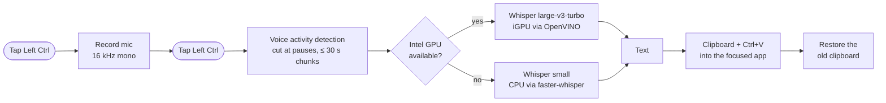

# WhisperClaude

**Dictate into any Windows app, locally and fast.** Tap **Left Ctrl**, speak (German, English or
both), tap again: the text appears in whatever text field has focus. Word, browser, chat, editor.

Most dictation tools process your voice in the cloud. WhisperClaude runs OpenAI's Whisper model
on your own laptop, so your audio never leaves it, and a 10-second sentence takes about a third
of a second on an Intel iGPU. Inspired by Wispr Flow.

<p align="center">
  
</p>

Built with [Claude Code](https://claude.com/claude-code). Every decision and its
measurements are documented in [`docs/PLAN.md`](docs/PLAN.md).

## What it does

- **One key, any app.** A short tap of Left Ctrl starts and stops recording; Ctrl+C, Ctrl+click
  and Ctrl+scroll don't trigger it. Your clipboard is restored after pasting.
- **German and English, even mixed,** with good punctuation, automatic language detection and a
  custom vocabulary for names ("Claude", "VS Code").
- **Formatting by voice.** Say "command new line", "command bullet", … to get line breaks,
  Markdown bullets and quotes while you dictate. Only these exact pairs are ever replaced.
- **Private.** No cloud, no account, works offline after the first model download.
- **Fast and light.** Uses the Intel iGPU if there is one, else the CPU. Negligible idle cost;
  starts silently at login with a tray icon.

## Installation

Windows 11 (10 untested), Python 3.12+, about 2 GB for the models. An Intel GPU/iGPU (Core Ultra,
Arc) is optional; without one the CPU is used.

```powershell
git clone https://github.com/philipp-sz/WhisperClaude.git
cd WhisperClaude
py -m venv .venv
.venv\Scripts\python.exe -m pip install -e .
.venv\Scripts\python.exe -m whisperclaude
```

The last command is a first run with a console, to watch the model download (on an iGPU also a
one-time ~15 s compile). To start it automatically at every login (Task Scheduler logon task):

```powershell
.venv\Scripts\python.exe scripts\install_autostart.py            # install and start
.venv\Scripts\python.exe scripts\install_autostart.py --remove   # uninstall
```

## Usage

1. Click into any text field and tap **Left Ctrl**. A pill shows level bars that follow your voice.
2. Speak, then tap **Left Ctrl** again. The text is pasted a moment later.

The tray icon (under the **^** arrow next to the clock) shows the state; right-click it for
status, config, restart, log and quit.

<p align="center">
  
</p>

### Formatting by voice

Say the trigger word **command** followed by one of these (always in English, also while
dictating German):

| You say | You get |
|---|---|
| `command new line` | a line break |
| `command new paragraph` | a blank line |
| `command bullet` | a new line starting with `- ` (Markdown list item) |
| `command separator` | a Markdown separator `---` with a blank line above and below |
| `command open quote` … `command close quote` | `"…"` |

For example "My shopping list. Command bullet milk. Command bullet eggs. That is all." becomes:

```
My shopping list.
- milk
- eggs

That is all.
```

A bullet item ends at the end of its sentence, and the text after it starts after a blank line
(which is also what ends a list in Markdown). Because
a command is always trigger + command word, sentences that merely contain "new line" or "bullet"
are left alone, and so is "command" used as an ordinary noun ("the command bullet by bullet").
If Whisper mishears a command it simply stays in the text, where you can see and fix it. The trigger word, the bullet character and an on/off switch are in the `[commands]`
section of `config.toml`.

Settings (hotkey, device, language, vocabulary, …) are in the commented
[`config.toml`](config.toml). After editing, use tray → **Restart (apply config)**.

## How it works



- **Accuracy.** Cutting at speech pauses avoids stray capitals after pauses and words lost at
  Whisper's 30 s window edge. A punctuated bilingual example plus your vocabulary is given to the
  model as "previous text", which steers punctuation and spelling and keeps mixed German/English
  audio from being translated into one language.
- **Two backends.** OpenVINO on the iGPU, or faster-whisper on the CPU if there is no GPU or
  loading it fails. Chosen at startup.
- **Always responsive.** Hotkey, tray and pill come up first and the model loads in the
  background; a tap during loading says "still loading". After a wake from sleep the hotkey and
  audio devices are re-armed.

Measured on an Intel Core Ultra 7 258V (Arc 140V iGPU), on battery:

| Backend | 10 s audio | 60 s audio | Extra energy per 60 s dictation |
|---|---|---|---|
| faster-whisper small, CPU | 3.6 s | 6.9 s | ~38 J |
| **OpenVINO large-v3-turbo, iGPU** | **0.33 s** | **1.5 s** | **~19 J** |

RAM is about 1.2 GB with the iGPU model loaded; idle CPU is about 1 % of one core, with no
measurable effect on battery draw. Benchmarks behind each decision: [`docs/PLAN.md`](docs/PLAN.md).
Logs (never containing transcripts): `%LOCALAPPDATA%\WhisperClaude\log.txt`.

**Limitations:** Windows only; only text on the clipboard is restored (an image would be lost);
no leading space when dictating after existing text; the NPU isn't used (OpenVINO's Whisper
pipeline failed on it).

## Development

```powershell
.venv\Scripts\python.exe -m pip install -e .[dev]
.venv\Scripts\python.exe -m pytest          # fast tests (no model, no hardware)
.venv\Scripts\python.exe -m pytest -m slow  # real models on CPU and (if present) iGPU
```

The slow tests need two short clips of your own voice. They aren't in the repo (`*.wav` is
git-ignored); without them the tests are skipped and print the `scripts/record_clip.py` command.

## License

MIT, see [LICENSE.md](LICENSE.md). Dependencies are installed via pip and models downloaded at
runtime; they keep their own licenses:

| Component | License |
|---|---|
| [faster-whisper](https://github.com/SYSTRAN/faster-whisper), CTranslate2, ONNX Runtime, sounddevice, Whisper models ([OpenAI](https://github.com/openai/whisper), [Systran](https://huggingface.co/Systran/faster-whisper-small) and [OpenVINO](https://huggingface.co/OpenVINO) conversions), Silero VAD | MIT |
| OpenVINO (+ GenAI, Tokenizers), Hugging Face tokenizers / huggingface_hub | Apache-2.0 |
| NumPy, PyAV, psutil, pyperclip; Pillow | BSD; MIT-CMU |
| [pynput](https://github.com/moses-palmer/pynput), [pystray](https://github.com/moses-palmer/pystray) | LGPL-3.0 (unmodified, installed separately) |

"Wispr Flow" is mentioned only to describe the idea; this project is not affiliated with it.
